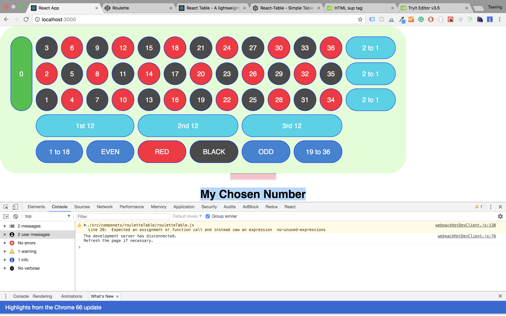

## Play Roulet 





```bash
  npm install
  
  npm run deploy
  npm i --save gh-pages
```

### Config to run on gitHub
```bash
Package.json
  "homepage": "https://XKalden/React_Roulette",

   "scripts": {
    "predeploy": "npm run build",
    "deploy": "gh-pages -d build",}

```